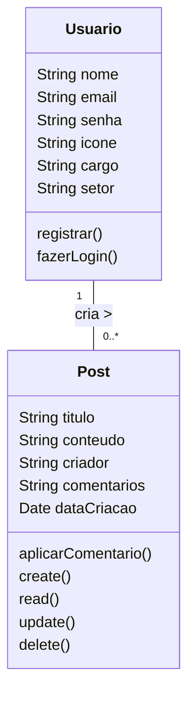
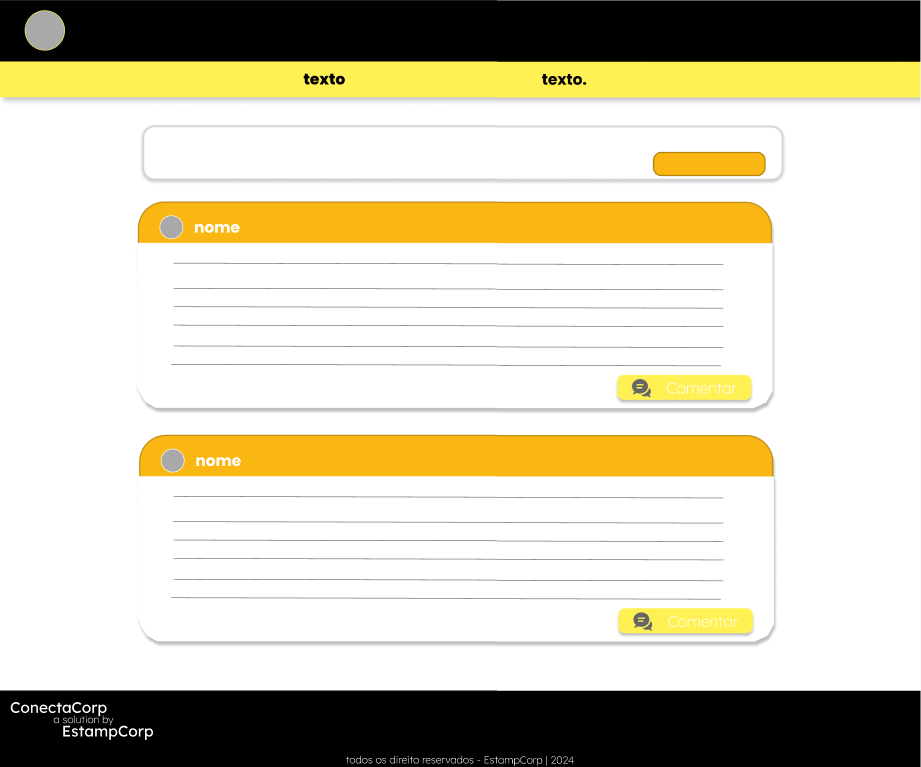
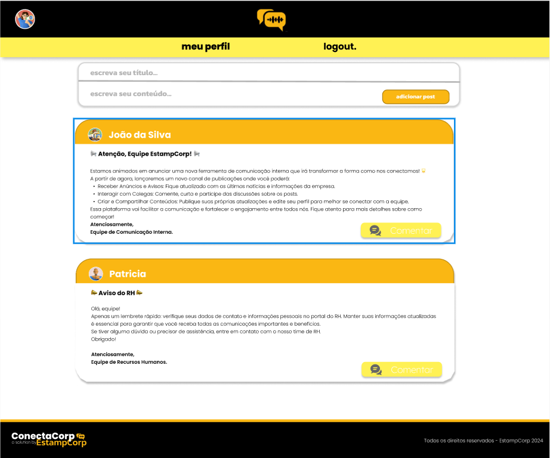

# WORKPLACE

## Escopo
Desenvolver uma plataforma online para avisos e interação entre funcionários da empresa `EstampCorp`, onde usuários podem `criar`, `editar` e `deletar` suas próprias publicações, além de `alterar` informações do seu perfil. A plataforma deve oferecer uma interface intuitiva e funcionalidades de interação como comentários.

## Objetivos
Desenvolver uma plataforma online de **Avisos e Interação**, permitindo criação de `POSTS` e gerenciamento de `PERFIS` dentro de um prazo de `4 meses.`

## Objetivos Específicos
- Desenvolver e Implementar o Sistema de Cadastro e Autenticação de Usuários
- Desenvolver Funcionalidades de Comentários
- Criar uma Interface de Usuário Intuitiva e Responsiva
- Implementar Sistema de Testes e Garantia de Qualidade
- Realizar o Deploy e Lançamento da Plataforma

### Mensuráveis
- Cadastro e Login
- Criação de Posts
- Interface de Usuário
- Qualidade e Testes
- Deploy e Lançamento

### Atingíveis
- Utilizar bibliotecas confiáveis para autenticação e gerenciamento de estado no `React`, e frameworks como `Next.js` e `JWT` no Node.js para garantir um sistema seguro e funcional.
- Implementar funcionalidades utilizando recursos testados e disponíveis no Node.js e React, garantindo a entrega dentro do prazo.
- Utilizar frameworks e bibliotecas `front-end` para criar uma interface responsiva e intuitiva.
- Alocar tempo suficiente para `testes` e correções de bugs.
- Utilizar ferramentas de CI/CD como GitHub Actions para garantir um `deploy` eficiente e seguro.

### Relevantes
`Cadastro e Login:` Essencial para garantir que os usuários possam gerenciar seus posts de forma personalizada e segura.

`Interface de Usuário (UX/UI):` Crucial para a experiência do usuário. Uma interface amigável aumenta a usabilidade.

`Gerenciamento de Posts:` Fundamental para a funcionalidade principal da plataforma, permitindo que os usuários interajam efetivamente com os posts.

`Testes:` Garante que a plataforma funcione conforme o esperado, minimizando problemas.

`Deploy:` Garantir que a plataforma esteja disponível e funcional para todos os usuários finais.

### Planejamento e Cronograma: 
`Mês 1: Planejamento e Design`

**Definição de Escopo e Objetivos:**
- Reuniões com stakeholders para definir escopo, objetivos e requisitos.
- Elaboração de documentos de requisitos e planejamento.
- Design da Arquitetura e Protótipos:
- Desenvolvimento da arquitetura do sistema.
- Criação de protótipos de média e alta fidelidade.
- Definição de tecnologias e planejamento da infraestrutura.

`Mês 2: Desenvolvimento do Back-End (Node.js)`

**Configuração do Ambiente de Desenvolvimento e Funcionalidades Básicas:**
- Implementação de autenticação e gerenciamento de usuários.
- Funcionalidades Avançadas do Back-End:
- Desenvolvimento de APIs para gerenciamento de tarefas.
- Integração com o banco de dados (por exemplo, MongoDB).

`Mês 3: Desenvolvimento do Front-End (React)`

**Desenvolvimento das Páginas Principais:**
- Implementação das páginas de cadastro e login.
- Criação das telas para visualização e gerenciamento de posts.
- Desenvolvimento das funcionalidades para criação, edição, e exclusão de posts.

`Mês 4: Integração e Testes`

**Integração Completa entre Front-End e Back-End:**
- Conectar as APIs do back-end com o front-end React.
- Realização de Testes e Correção de Bugs:
- Testes de integração e correção de problemas encontrados.
- Condução de testes de usabilidade com usuários reais e coleta de feedback.
- Implementação de melhorias finais e ajustes.

`Mês 4 (Final): Finalização e Lançamento`

**Preparação de Documentação e Material de Suporte:**
- Criação de documentação técnica e material de suporte para usuários.
- Lançamento da Aplicação/Deploy:
- Configuração do ambiente de produção e lançamento da plataforma.
- Monitoramento de Desempenho e Suporte:
- Monitoramento contínuo do desempenho e suporte pós-lançamento.

### Cronograma Visual

### Recursos Humanos
- Gerente de Projetos
- Desenvolvedor Back-End (Node.js) - Pleno
- Desenvolvedor Front-End (React) - Pleno
- DBA (Banco de Dados) - Pleno
- QA (Qualidade de Software) - Pleno
- Especialista em Segurança da Informação
- Estagiário em DEV (Documentação)

### Recuros de Ferramentas
- JIRA (Organização)
- VSCode (Desenvolvimento)
- Figma/Adobe (Design)
- Postman (Testes de API)
- GitHub Actions (CI/CD)
- MongoDB (Banco de Dados)
- React (Front-End)
- Node.js/Next.js (Back-End)

### Análise de Riscos
`Atrasos e Mudanças nos Requisitos:`
- Adoção de metodologias ágeis como Scrum e Kanban com reuniões frequentes.
- Elaboração de planos de contingência e comunicação clara com stakeholders.

`Problemas Técnicos e Bugs:`
- Realização de testes contínuos, revisões de código e monitoramento de falhas.

`Vulnerabilidades de Segurança:`
- Implementação de testes de segurança, atualizações constantes e controle de acesso.

`Problemas de Desempenho e Escalabilidade:`
- Testes de desempenho e otimização de recursos.

## Diagramas

### Diagrama de Classe 

### Diagrama de Uso
 

### Diagrama de Fluxo

## Protótipo da pagina principal de Posts:

- ### Baixa Fidelidade:
 

- ### Média Fidelidade:
 

- ### Alta Fidelidade:
 

